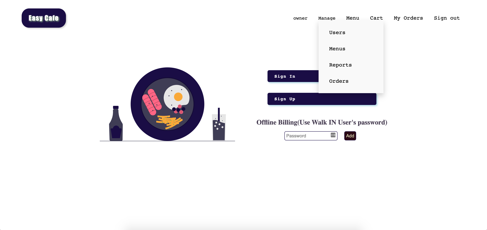
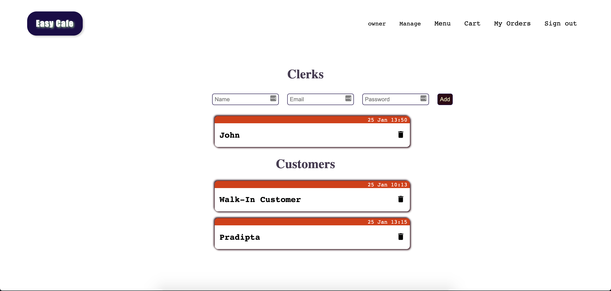
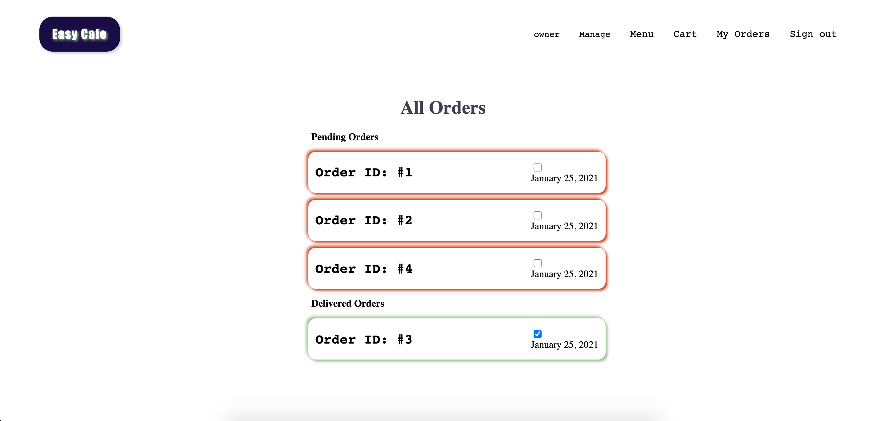

# Easy Cafe

[`Live Site`](https://easy-cafe.herokuapp.com/)

A cafeteria management system built with:

- Ruby On Rails (backend)
- HTML, CSS, JS (frontend)

- [x] It supports multiple user roles like `owner`, `clerk`, `customer`.
- [x] Offline billing through Walk-IN customer account.
- [x] See sales report.
- [x] Manage section for `owner`s and `clerk`s for sudo functionalities.

## Owner Credentials

`email: admin[at]admin[dot]com`
`password: admin`

### Owners Can

- Manage Users - Add, delete `clerks`
  
- Manage menus - create, update, delete and choose `active` menus
- Manage Orders - mark orders as delivered
- See Sales Report - See total sales on the site so far, see user's orders and details
- As well as anything a normal customer can do

## Clerk's Credentials

`email: h[at]h[dot]com`
`password: 12345`

### Clerks Can

- Manage Orders - - Manage Orders - mark orders as delivered
- As well as anything a normal customer can do
  

## Walk-In User's Credentials

`email: test[at]test[dot]com`
`password: 12345`
